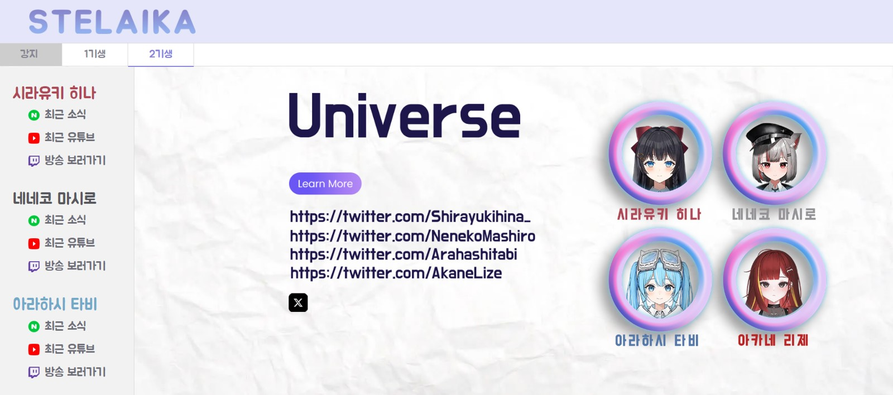
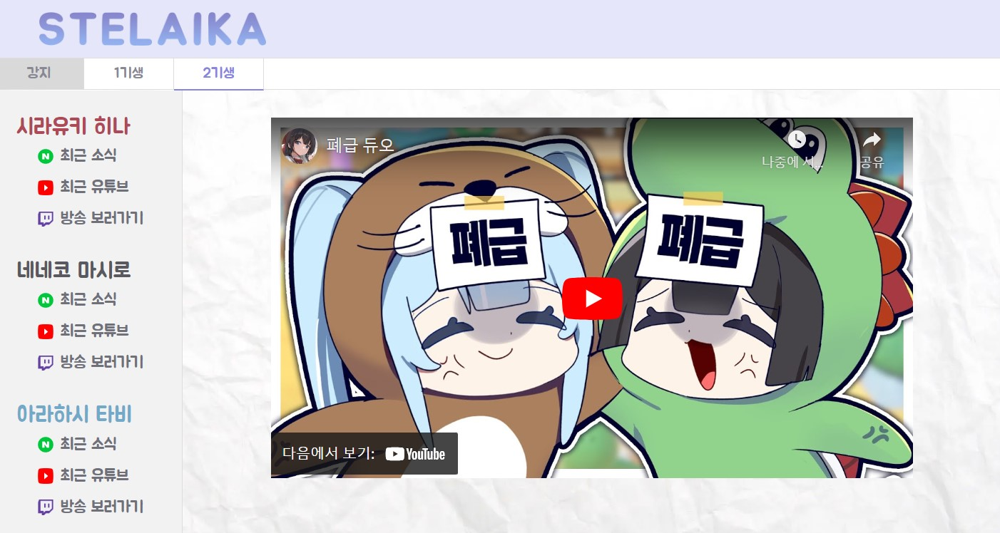

# STELAIKA

STELAIKA는 HTML, CSS, JavaScript를 사용하여 만든 스텔라이브 팬 사이트입니다.

## 목차

- [STELAIKA](#stelaika)
  - [목차](#목차)
  - [소개](#소개)
  - [기능](#기능)
    - [1. 초기 화면](#1-초기-화면)
    - [2. 메인 화면](#2-메인-화면)
    - [3. 메인화면 - 최근 팬카페 글](#3-메인화면---최근-팬카페-글)
    - [4. 메인화면 - 최근 유튜브](#4-메인화면---최근-유튜브)
    - [5. 메인화면 - 방송 보러가기](#5-메인화면---방송-보러가기)
  - [설치](#설치)
  - [라이센스](#라이센스)

## 소개

스텔라이브 멤버의 최신 활동을 정리하여 보여줍니다. 

멤버별 최근 유튜브 영상, 최근 팬카페 글, 스트리밍 영상을 제공합니다.

## 기능

### 1. 초기 화면

좌측 로고와 우측 배너를 css에서 display : flex 를 활용하여 배치하였습니다.

우측 배너를 클릭하여 해당 멤버 또는 그룹의 메인 화면으로 이동할 수 있습니다.

배너 클릭 시 GET 형식으로 홈페이지 링크를 호출합니다. 

이후 메인 화면이 처음 로드될 때 javascript에서 파라미터 정보 파싱 후 상응하는 홈페이지 정보를 제공합니다.

배너는 [GraphicsFamily](https://www.graphicsfamily.com/) 템플릿을 참고하여 photoshop을 활용해 제작했습니다.

### 2. 메인 화면

멤버별 최신 활동을 정리하여 보여주는 메인 화면입니다. 

좌측 상단에 있는 메뉴 선택 시 각 멤버 또는 그룹의 초기화면이 우측 영역에 노출됩니다.

좌측 메뉴 화면와 우측 화면 영역은 display : flex를 활용하여 배치하였습니다.

해당 메뉴 클릭 시 파라미터 전달과 함께 javascript 함수가 호출되며 전달받은 파라미터에 맞는 class만 display되도록 설정되는 방식으로 동작합니다.

좌측에 있는 "최근 팬카페 글", "최근 유튜브", "방송 보러가기" 메뉴도 마찬가지로 클릭 시 javascript 함수가 호출되며 같은 방식으로 동작합니다.

메뉴 클릭 후 우측에 노출되는 초기화면 이미지는 [GraphicsFamily](https://www.graphicsfamily.com/) 템플릿을 참고해 Photoshop으로 편집하여 제작하였습니다.

### 3. 메인화면 - 최근 팬카페 글

좌측 영역에서 "최근 팬카페 글" 메뉴를 클릭하면 멤버별 최근 팬카페 글을 확인할 수 있습니다.

우측 영역에서 상단 박스를 통해 글 제목, 글쓴이, 작성일 정보를 제공하며 클릭 시 해당 글 링크로 이동할 수 있습니다.

"최근 팬카페 글" 메뉴가 클릭되는 순간 javascript 함수가 호출되어 Flask 서버에 데이터를 요청하는 AJAX 호출이 일어나게 됩니다. 

Flask 서버에서는 전달받은 파라미터 정보를 바탕으로 Selenium을 활용하여 해당 멤버 최신 팬카페 글에 대한 정보를 크롤링합니다.

서버 부하 방지 및 빠른 정보 제공을 위해 크롤링된 데이터를 캐싱하고 있으며 일정 시간 내에 같은 데이터 요청이 들어오게 되면 캐싱된 정보를 제공하고 있습니다.

크롤링된 정보는 json 형식으로 javascript에 전송됩니다. 

이후 javascript에서 json 데이터를 해당 멤버에 대응하는 html의 class, id 위치에 삽입하여 최종적으로 html에서 크롤링된 정보를 확인할 수 있게 됩니다.

한편 AJAX 호출 후 데이터를 return 받을 때 까지는 로딩중을 알리는 박스가 홈페이지에 노출되며 html에 정보가 모두 제공된 이후에는 해당 로딩중 박스가 hide 처리되고 있습니다.

### 4. 메인화면 - 최근 유튜브

좌측 영역에서 "최근 유튜브" 메뉴를 클릭하면 멤버별 최근 유튜브 영상을 확인할 수 있습니다.

우측 영역에서 최근 유튜브 영상을 바로 확인할 수 있습니다.

데이터를 가져오는 방식은 "최근 팬카페 글" 항목과 동일하게 작동하고 있습니다.

최근 유튜브 데이터의 경우는 Flask 서버에서 유튜브 api를 활용하여 멤버별 최근 링크 얻은 후 json 형식으로 return 하고 있습니다.

유튜브 api 호출에 하루 제한횟수가 있어 마찬가지로 캐싱 기능을 활용하고 있습니다.

javascript에서 json 정보를 전달받은 후 iframe 형식으로 html의 적절한 clsss, id 위치에 삽입하여 영상을 제공합니다.

### 5. 메인화면 - 방송 보러가기

좌측 영역에서 "방송 보러가기" 메뉴를 클릭하면 멤버별 스트리밍 영상을 확인할 수 있습니다.

우측 영역에서 스트리밍 영상을 바로 확인할 수 있습니다.

"방송 보러가기" 메뉴 클릭 시 파라미터와 함께 javascript 함수가 호출됩니다.

javascript 함수에서는 파라미터 정보를 바탕으로 html에 embed 될 멤버별 iframe 태그 정보를 생성한 후 html의 적절한 class, id 위치에 삽입하여 영상을 제공합니다.

## 설치

1. 저장소를 복제합니다: `git clone https://github.com/aika1118/tmp.git`
2. `app.py` 파일을 실행합니다.

## 라이센스

이 프로젝트는 MIT 라이센스 하에 라이센스가 부여됩니다.
